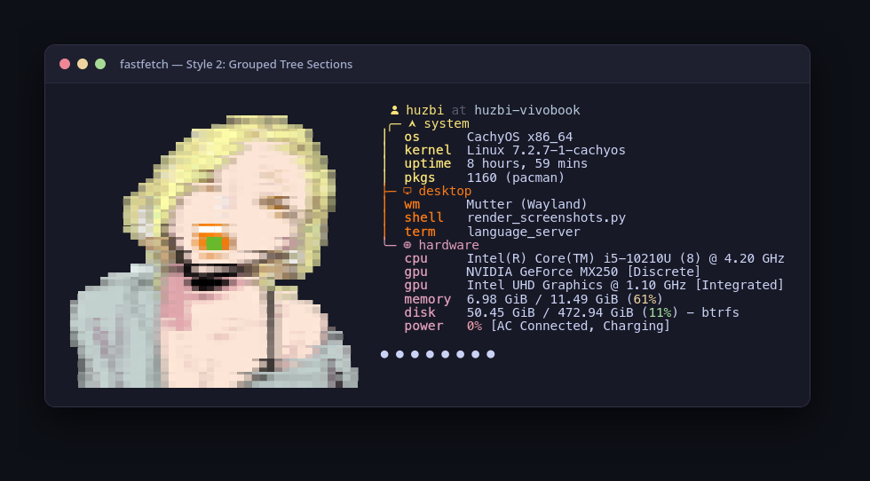

<div align="center">

# ✨ Anjou-san Fastfetch Config 🍒

*“Seto~, bet you can't tie a cherry stem with your tongue like this~”*

[](https://github.com/fastfetch-cli/fastfetch)
[](https://myanimelist.net/manga/111357/Yancha_Gal_no_Anjou-san)
[](#)

<br/>



</div>

---

### 🌸 About

A sleek, minimal Fastfetch configuration featuring **Anna Anjou** from *Yancha Gal no Anjou-san* (ヤンチャギャルの安城さん).

- **High-Definition ANSI Half-Block Art**: Proportioned specifically for terminal monospace font metrics (no vertical stretching or squishing).
- **Iconic Cherry Stem Knot**: Accurately captures her playful expression with her tongue sticking out and the folded green cherry twig knot.
- **Grouped Tree Hierarchy**: Neatly arranges your specs into `system`, `desktop`, and `hardware` branches to eliminate visual clutter.

---

### 🚀 Quick Start

#### 1. Prerequisites
- [Fastfetch](https://github.com/fastfetch-cli/fastfetch) (`v2.0+`)
- Any **Nerd Font** (e.g., MesloLGS, JetBrains Mono, or FiraCode) for icons.

#### 2. Install

Clone directly into your Fastfetch config directory:

```bash
mkdir -p ~/.config/fastfetch
git clone https://github.com/Huzbi-crypto/anjou-san-fast-fetch-config.git /tmp/anjou-ff
cp -r /tmp/anjou-ff/ascii ~/.config/fastfetch/
cp /tmp/anjou-ff/fast-fetch-config.jsonc ~/.config/fastfetch/config.jsonc
rm -rf /tmp/anjou-ff
```

*(Or if you already cloned this repo locally, simply run:)*

```bash
mkdir -p ~/.config/fastfetch
cp -r ascii ~/.config/fastfetch/
cp fast-fetch-config.jsonc ~/.config/fastfetch/config.jsonc
```

#### 3. Run

```bash
fastfetch
```

---

<div align="center">

Made with 💛 for Anjou-san fans. Enjoy your rice! 🍒

</div>
